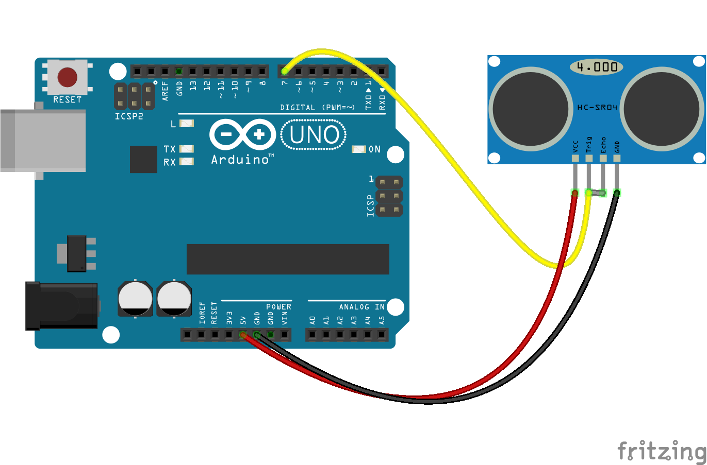

# Above and Beyond Topic 7
 In this task we made a Program that interacts with Arduino using johnny-five library and publishes those messages using MQTT protocol to a specific topic of the same ID as the device.
 
 This has been done as we're using Arduino UNO and it can't directly communicate with the internet and hence MQTT broker, to overcome this limitation we are using this method of transferring data over MQTT using johnny-five.

## The use purpose of each file is as follows:

- ### **arduinotalky.js**
    This is run in the background for communicating with the Arduino UNO board. This works with the Firmata library installed on the Arduino UNO before using this js file for interacting with it. 

- ### **mqtt.js**
    This js file caputers the MQTT messages sent by **arduinotalky.js**, and upon receiving the messages it structures the messages and sends them to mongodb for storage 

- ### **device.js**
    This is the schema for our Mongo DB database collection. 

- ### **.env**
    This file stores my Mongo DB access key and is a secret.

- ### **.env.example**
    This is an example .env file for reference.

## Schematic Diagram 

# Pre-requisites
StandardFirmata Plus won't work in this case and the easist way to get this working is if you use [PingFirmata](https://gist.githubusercontent.com/rwaldron/0519fcd5c48bfe43b827/raw/f17fb09b92ed04722953823d9416649ff380c35b/PingFirmata.ino)

Upload it on the Arduino Board and get it ready to communicate with your johnny-five program.